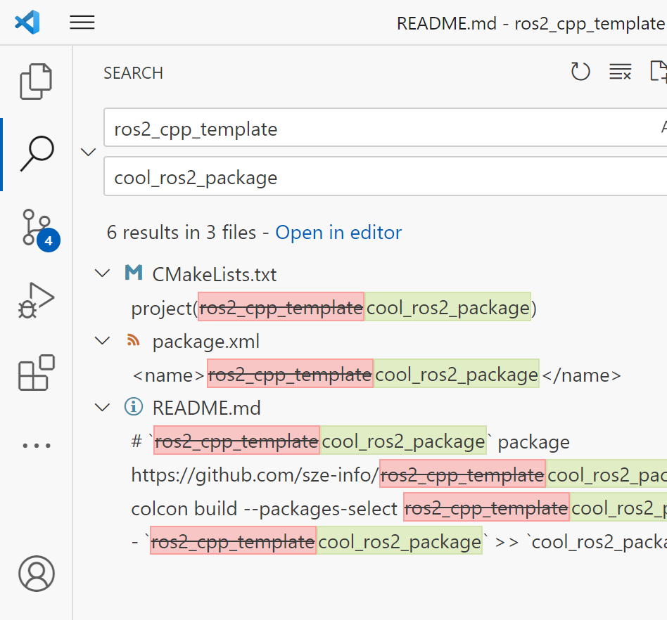

# `bal_f4w_kisbeadando` package
ROS 2 C++ package.  [](https://docs.ros.org/en/humble/)
## Packages and build

It is assumed that the workspace is `~/ros2_ws/`.

### Clone the packages
``` r
cd ~/ros2_ws/src
```
``` r
git clone https://github.com/setofi-pandor/bal_f4w_kisbeadando
```

### Build ROS 2 packages
``` r
cd ~/ros2_ws
```
``` r
colcon build --packages-select bal_f4w_kisbeadando --symlink-install
```

<details>

``` r
ros2 launch sze_sw1_szinusz launch_example1.launch.py
```

``` r
ros2 run sze_sw1_szinusz gen_node 
```

``` r
ros2 run sze_sw1_szinusz sum_node 
```
<summary> Don't forget to source before ROS commands.</summary>

``` bash
source ~/ros2_ws/install/setup.bash
```
</details>

``` r
ros2 launch bal_f4w_kisbeadando launch_example1.launch.py
```

# Delete this part if you are using it as a template

ROS 2 pacage template, to get started, use template by clicking on the Green button labeled [`Use this template`](https://github.com/setofi-pandor/bal_f4w_kisbeadando/generate) / [`Create new repository`](https://github.com/setofi-pandor/bal_f4w_kisbeadando/generate). 

<p align="center"></p>


Let's assume 
- your Github username is `setofi-pandor`
- your ROS 2 repo shold be `bal_f4w_kisbeadando`

Replace everything in the cloned repo:

- `bal_f4w_kisbeadando` >> `bal_f4w_kisbeadando` (the folder was already renamed after `Use this template`)
- `setofi-pandor` >> `setofi-pandor`
- find all `bal_f4w_kisbeadando` strings and fill the blanks

The easiest way is VS code:

<p align="center"></p>

Now `colcon build` your ROS 2 package and you can start wokring.